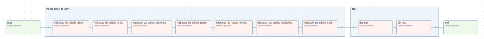
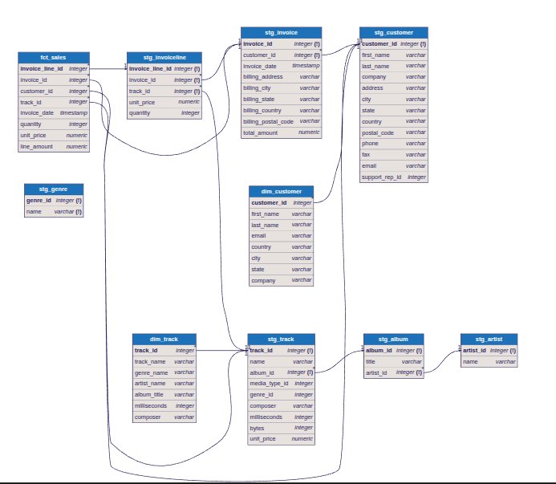

# Projeto de Pipeline de Dados: SQLite → Postgres + dbt + Airflow


## Pré-requisitos
- Docker e Docker Compose instalados


## Como subir o projeto
1. Clone o repositório e acesse a pasta do projeto:
   ```sh
   mkdir chinook_ap
   cd chinook_ap
   git clone https://github.com/raphaellorena13/chinook_ap.git .
   ```

2. Suba os containers:
   ```sh
   docker compose up --build
   ```

**Observação:**
Se ocorrer erro de permissões nas pastas, execute no diretório do projeto:
```sh
sudo chown -R 50000:0 ./
sudo chmod -R 775 ./
```
Isso libera os subdiretórios do projeto para o usuário do container.

3. Acesse o Airflow em: [http://localhost:8080](http://localhost:8080)
Login: `admin` | Senha: `admin`


## Como rodar a DAG
1. No Airflow Web UI, ative a DAG `etl_sqlite_to_analytics`.
2. Clique no botão de play (Trigger DAG) para executar manualmente.
3. Acompanhe o status das tasks e logs pela interface.

**Visualização da DAG:**



## Como validar no Postgres
1. Conecte-se ao banco Postgres (ex: DBeaver) com:
   - Host: `localhost`
   - Porta: `5432`
   - Usuário: `airflow`
   - Senha: `airflow`
   - Banco: `postgres`

2. Exemplos de queries:
   - Contar registros migrados:
     ```sql
     SELECT COUNT(*) FROM raw.customer;
     SELECT COUNT(*) FROM raw.invoice;
     ```
   - Consultar dados transformados (schema analytics):
     ```sql
     SELECT * FROM analytics.dim_customer;
     SELECT * FROM analytics.dim_track;
     SELECT * FROM analytics.fct_sales;
     ```

3. Para facilitar a visualização dos relacionamentos, veja a imagem gerada via dbml:
   


## Decisões de modelagem (breve)
- **Staging:** Todas as tabelas do SQLite são carregadas para o schema `raw` no Postgres.
- **dbt:** Modelos de staging padronizam tipos, nomes e aplicam TRIM em textos.
- **Marts:** Dimensões e fatos (`dim_customer`, `dim_track`, `fct_sales`) são criadas no schema `analytics`.
- **Testes dbt:** Integridade, not null, unique e relacionamentos entre tabelas.
- **Airflow:** Orquestra a migração, transformação e testes de ponta a ponta.


## Como abrir o Power BI e conectar no Postgres
1. Abra o Power BI Desktop.
2. Clique em "Obter Dados" > "Banco de dados PostgreSQL".
3. Preencha:
   - Servidor: `localhost`
   - Banco de dados: `postgres`
   - Usuário: `airflow`
   - Senha: `airflow`
4. Avance, selecione o schema desejado (`raw` ou `analytics`) e as tabelas para análise.
5. Carregue os dados e crie seus relatórios!


---

Dúvidas? Consulte os arquivos `dags/etl_sqlite_to_analytics.py`, `analytics/models/`, ou abra uma issue.
